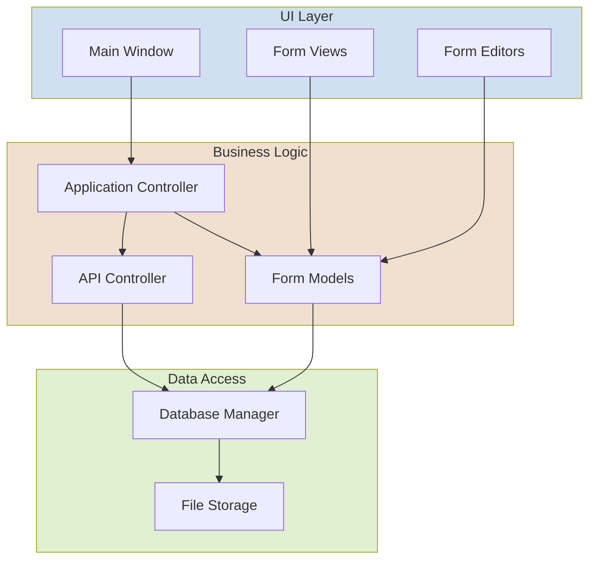

# RadioForms Architecture Analysis

## 1. Summary of Findings

RadioForms implements a desktop application for managing FEMA Incident Command System (ICS) forms using Python with PySide6 (Qt) for UI and SQLite for data storage. The application follows a layered architecture with separation of concerns but exhibits signs of overengineering and unnecessary complexity for its scope.

### Key Observations:

- **Architectural Overengineering**: The application implements sophisticated patterns and mechanisms that exceed what's necessary for its relatively simple domain requirements.
- **Redundant Implementation**: Multiple versions of similar components exist (standard, enhanced, refactored), creating maintenance challenges.
- **Complex DAO Layer**: The data access layer is highly abstracted with multiple inheritance and specialized implementations.
- **Form Management Complexity**: The form handling system is disproportionately complex for the limited number of form types (primarily ICS-213 and ICS-214).
- **Excessive Abstraction**: Several layers of abstraction that add complexity without clear benefits.

## 2. Detailed Findings and Comments

### 2.1. Application Architecture

#### Current Structure:
- Multi-layered MVC-like pattern with:
  - Views (UI components)
  - Controllers (app, forms, API)
  - Models (form models, persistence)
  - Data Access (DAO layer)
  - Database (SQLite with schema versioning)

#### Key Issues:
- **Multiple controller types** with overlapping responsibilities (AppController, FormsController, APIController).
- **Overly complex event/signal flow** between components.
- **Redundant code paths** for similar operations.
- **Multiple versions of components** (standard, enhanced, refactored) without clear deprecation strategy.

### 2.2. Database Integration (SQLite)

#### Current Implementation:
- Custom schema versioning and migration system
- Multiple DAO implementations with caching
- Complex transaction management
- Version history tracking

#### Key Issues:
- **Schema manager complexity**: The migration system is sophisticated but seems excessive for the application's needs.
- **Excessive abstraction in DAOs**: Base DAO, specialized DAOs, refactored DAOs, bulk operation DAOs add complexity.
- **Over-designed versioning**: Form versioning system seems overengineered for basic revision history.

### 2.3. UI Layer (PySide6)

#### Current Implementation:
- Main window with tab-based interface
- Form editors and viewers for different form types
- Form selection and filtering
- Signal/slot mechanism for UI updates

#### Key Issues:
- **Moderate complexity**: The UI layer is relatively well-structured but still has more complex components than necessary.
- **Direct model-view coupling**: In some places, tight coupling exists between models and views.
- **Redundant view code**: Similar patterns repeated across different form views.

### 2.4. Code Complexity and Maintainability

#### Key Issues:
- **Excessive property management**: Many models have extensive property getters/setters with notification system.
- **Form resolution complexity**: The enhanced form resolver adds significant complexity for handling just a few form types.
- **Redundant validation**: Validation occurs at multiple levels (model, controller, database).
- **Lengthy class implementations**: Many classes exceed 300-500 lines of code.
- **Complex error handling**: Error handling is distributed across multiple layers.

### 2.5. Deployment Considerations

#### Current Implementation:
- Standard Python package structure
- Local file storage for forms and attachments
- SQLite database for persistence

#### Key Issues:
- **File management complexity**: Attachment handling adds significant complexity.
- **Database backup mechanisms**: More complex than needed for a simple offline application.

## 3. Recommendations

### 3.1. Architectural Simplification

1. **Consolidate controller layers**:
   - Merge AppController and FormsController into a single ApplicationController.
   - Keep APIController separate but simplify its interface.

2. **Simplify data access layer**:
   - Replace the complex DAO hierarchy with simpler, direct database access classes.
   - Use a lightweight ORM like SQLAlchemy or Peewee instead of custom DAOs.

3. **Streamline form models**:
   - Reduce the inheritance depth and property management complexity.
   - Use dataclasses or similar constructs for simpler model definitions.

4. **Simplify database schema management**:
   - Replace the custom migration system with a simpler solution or use an established ORM's migration tools.
   - Reduce the complexity of the schema versioning system.

### 3.2. Code Organization

1. **Adopt a simpler project structure**:
   ```
   radioforms/
   ├── core/               # Core application logic
   │   ├── models.py       # Data models
   │   ├── database.py     # Database access
   │   └── utils.py        # Utilities
   ├── ui/                 # UI components
   │   ├── main_window.py  # Main application window
   │   ├── forms/          # Form-specific UI components
   │   └── widgets/        # Reusable widgets
   ├── forms/              # Form implementations
   │   ├── base.py         # Base form functionality
   │   ├── ics213.py       # ICS-213 form
   │   └── ics214.py       # ICS-214 form
   └── main.py             # Application entry point
   ```

2. **Consolidate duplicate implementations**:
   - Choose one approach for each component (standard, enhanced, or refactored) and remove others.
   - Document the chosen approach clearly.

### 3.3. Database Simplification

1. **Adopt a simpler database approach**:
   - Use an ORM like SQLAlchemy or Peewee for database operations.
   - Implement a simpler migration strategy (or use ORM-provided migrations).
   - Simplify the schema to focus on essential data relationships.

2. **Reduced form versioning complexity**:
   - Implement a simpler versioning mechanism focused on essential form history.
   - Store only deltas or simplified version information rather than complete form copies.

### 3.4. UI Improvements

1. **Simplify view management**:
   - Use more standard PySide6/Qt patterns without excessive abstraction.
   - Implement a clearer separation between views and models.

2. **Standardize form interfaces**:
   - Create a more consistent interface for all form types.
   - Reduce duplication in form editors and viewers.

### 3.5. Testing Strategy

1. **Simplify test structure**:
   - Focus on end-to-end testing of key workflows rather than extensive unit testing of each layer.
   - Implement more integration tests for critical paths.

## 4. Suggested Simplified Architecture Diagram



## 5. Conclusion

The RadioForms application exhibits signs of overengineering for its relatively simple domain. While the architecture demonstrates good software engineering principles like separation of concerns, it implements these at a scale and complexity level more appropriate for a large enterprise application than a desktop form management tool.

The recommended simplifications would:
- Reduce code complexity and maintenance burden
- Improve the ability to extend the application with new form types
- Maintain the same functionality while making the codebase more approachable
- Reduce potential for bugs and inconsistencies
- Allow more focus on core functionality and user experience

The core strength of the application lies in its domain-specific functionality for ICS forms. Simplifying the technical architecture would allow more focus on this domain-specific value rather than on maintaining complex technical infrastructure.
